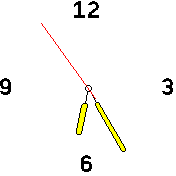

# banglejs-2-hollow-clock-hands #

draws (optionally filled) hollow hands for an analog clock on a Bangle.js 2

This module draws (optionally filled) hollow hands (with a small bolt in the center) for an analog clock running on a [Bangle.js 2](https://www.espruino.com/Bangle.js2).



## Usage ##

Within a clock implementation, the module may be used as follows:

```
let Clockwork = require(...);
Clockwork.windUp({
  hands:require('https://raw.githubusercontent.com/rozek/banglejs-2-hollow-clock-hands/main/ClockHands.js'),
  ...
});
```

## Example ##

The following code shows a complete example for a (still simple) analog clock using these clock hands:

```
let Clockwork = require('https://raw.githubusercontent.com/rozek/banglejs-2-simple-clockwork/main/Clockwork.js');

Clockwork.windUp({
  face: require('https://raw.githubusercontent.com/rozek/banglejs-2-four-fold-clock-face/main/ClockFace.js'),
  hands:require('https://raw.githubusercontent.com/rozek/banglejs-2-hollow-clock-hands/main/ClockHands.js'),
},{
  Foreground:'#000000', Background:'#FFFFFF', Seconds:'#FF0000', FillColor:'#FFFF00'
});
```

`Settings.Seconds` is optional and specifies the color in which the second hand should be drawn - if it is missing, `null` or `undefined`) no second hand will be drawn.

`Settings.FillColor` specifies whether hour and minute hands will be filled or not:

* `null`, `undefined` or missing: hands will *not* be filled,
* `'Theme'`: hands will be filled with the current theme's foreground highlight color (`theme.fgH`)
* (color): any valid Espruino color specification fills the hands with that color

## License ##

[MIT License](LICENSE.md)
